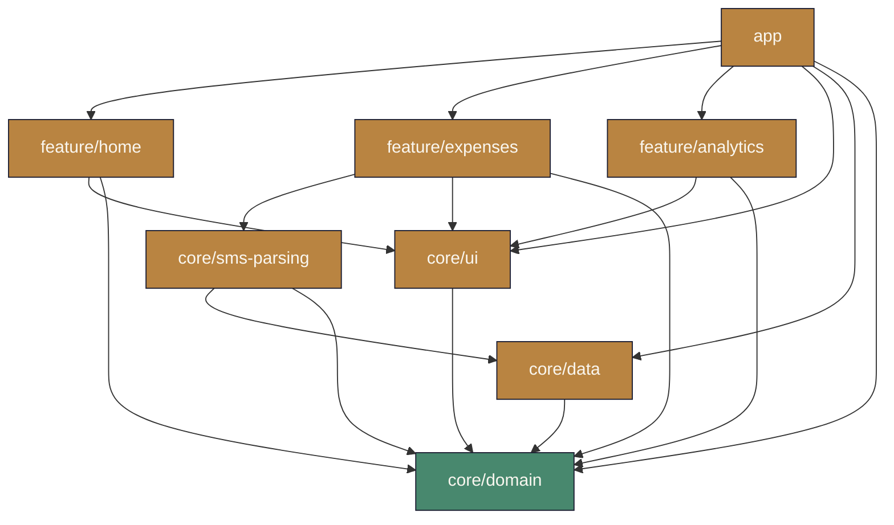
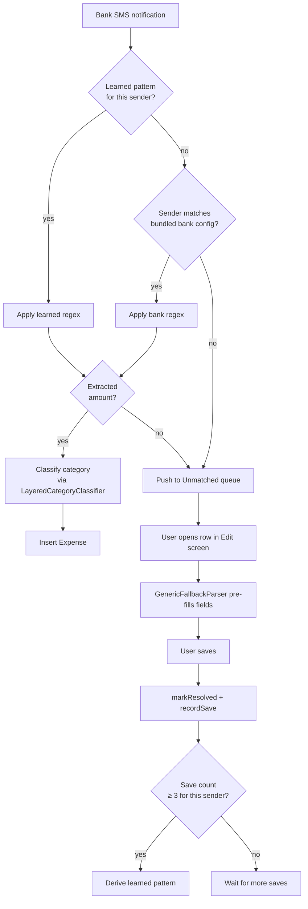
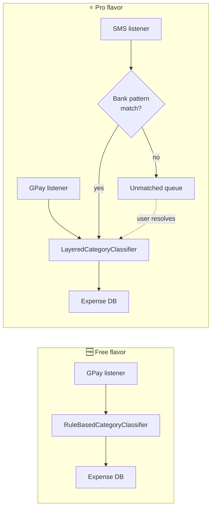

<div align="center">


# XpensTracker

**Effortless expense tracking for the UAE — Google Pay notifications and bank SMS become expenses, automatically.**


<br />

<!-- TODO: replace the two href="#" below with your Free / Pro APK download URLs (Release asset or Play Store link) -->
<a href="#">
  
</a>
&nbsp;
<a href="#">
  
</a>

<br /><br />


</div>

---

## Demo

<video src="https://github.com/Sokhib/XpensTracker-Wiki/raw/main/docs/media/Screen_recording_20260512_084245.webm" controls width="320"></video>

> Safari doesn't play `.webm` inline — [open the video directly](docs/media/Screen_recording_20260512_084245.webm) instead.

---

## Features

### Auto-capture from Google Pay

> Listens to your Google Pay notifications, parses the amount and merchant, and files the expense for you. Zero taps.

A foreground `NotificationListenerService` runs in both flavors, watching for GPay payment notifications. Amounts and merchant names are extracted on-device and saved as expenses — automatically categorized using a UAE-aware rule engine.

### Bank SMS parsing *(Pro)*

> Your bank's transaction SMS becomes an expense the moment it arrives.

Pro ships bundled patterns for **Emirates NBD**, **Emirates Islamic**, **ADCB**, and **FAB**, plus sender-only attribution stubs for **Mashreq**, **DIB**, **RAKBANK**, **CBD**, and **ADIB**. SMS that don't match any bank pattern land in an *unmatched queue* — open one and the app pre-fills the edit form from a best-effort generic parser. Save it, and the app learns the sender's pattern after **3 confirmations**.

### Smart categorization

> Carrefour → Groceries. DEWA → Bills. Talabat → Food. No setup required.

Two layers of UAE-aware classification:
- A canonical **merchant catalog** with exact-match mappings (Carrefour, Lulu, Talabat, Careem, DEWA, Etisalat, etc.)
- A **rule-based classifier** with 100+ keyword rules covering the long tail

If nothing matches, the expense is flagged `Uncategorized` so you can review it — distinct from `Other`, which is a real explicit user choice.

### Dashboard

> Hero balance card, category pie, recent expenses, unmatched-queue badge.


### Expense ledger with chip filters

> Filter by category, bank, payment method. Swipe to delete. Search by merchant.


### Filter sheet

> Chip-based multi-dimensional filtering — combine categories, banks, and payment methods.


### Monthly insights

> Natural-language observations on your spending patterns, trend charts, category breakdowns.


### Settings

> Theme, currency, profile, notification permissions — including separate toggles for the GPay and Bank-SMS listeners.


---

## Layl — Dark mode

XpensTracker ships a hand-tuned dark palette called **Layl** (Arabic: *night*). Deep midnight surfaces, warm gold primary, ivory text — designed to be easy on the eyes without losing the warmth of the light theme.

<table>
  <tr>
    <td align="center"><br /><sub>Dashboard</sub></td>
    <td align="center"><br /><sub>Ledger</sub></td>
  </tr>
  <tr>
    <td align="center"><br /><sub>Insights</sub></td>
    <td align="center"><br /><sub>Settings</sub></td>
  </tr>
</table>

---

## Architecture

Multi-module **MVVM + Clean Architecture**. Pure-Kotlin domain at the center, Android-aware layers wrap around it.

### Module dependency graph



**Dependency rule:** `feature/*` and `app` depend on `core/*`. `core/domain` has zero Android dependencies. `core/data` implements domain interfaces. `core/sms-parsing` depends on `core/domain` + `core/data`.

### SMS → Expense pipeline *(Pro)*



### Build flavors



---

## Build variants

`flavorDimensions = ["tier"]` — Free and Pro install **side-by-side** (different `applicationId`s).

| Variant | applicationId | Version suffix | Capabilities |
|---|---|---|---|
| **Free** | `com.example.xpenstracker` | — | GPay notification capture only |
| **Pro** | `com.example.xpenstracker.pro` | `-pro` | GPay capture **+** UAE bank SMS parsing **+** self-learning unmatched queue |

The database schema is shared — Pro-only tables ship empty in Free.

---

## Design system — AquaTheme

A custom Material 3 theme built around **Dubai / MENA** warmth: gold, sage, desert rose, deep midnight. Two palettes:

### Shams (light) — *warm sand paper*

| Token | Hex | |
|---|---|---|
| Primary | `#B98441` |  |
| Primary Dim | `#9C6830` |  |
| Secondary (Sage) | `#48886E` |  |
| Tertiary (Desert Rose) | `#C45D46` |  |
| Surface | `#FAF7F0` |  |
| On Surface | `#1C1E32` |  |

### Layl (dark) — *deep midnight*

| Token | Hex | |
|---|---|---|
| Primary | `#E8B765` |  |
| Primary Dim | `#C28642` |  |
| Secondary (Sage) | `#9CD9B8` |  |
| Tertiary (Desert Rose) | `#E29785` |  |
| Surface | `#181824` |  |
| On Surface | `#FAF6EC` |  |

### Category palette

Each category gets its own tuned hue, paired across light/dark.

| Category | Light | | Dark | |
|---|---|---|---|---|
| Food | `#BC6A47` |  | `#E09878` |  |
| Transport | `#3F6B90` |  | `#8AADC5` |  |
| Shopping | `#9B5A85` |  | `#C79BBE` |  |
| Bills | `#C25E54` |  | `#E39089` |  |
| Entertainment | `#B0983F` |  | `#CFC274` |  |
| Health | `#4D8C72` |  | `#9CD9B8` |  |
| Education | `#5976B3` |  | `#8AA2D4` |  |
| Grocery | `#3F8C5C` |  | `#7BCC8B` |  |
| Other | `#7F8391` |  | `#A4A6B0` |  |

### Typography

| Family | Role | Notable use |
|---|---|---|
| **Fraunces** *(variable serif)* | Display headlines, monetary amounts | `amount` style at 22sp |
| **Figtree** *(variable sans)* | Body & labels | 14–16sp, Regular / Medium / SemiBold / Bold |

### Spacing scale

| Token | dp | | Token | dp |
|---|---|---|---|---|
| none | 0 | | lg | 16 |
| xxs | 2 | | xl | 24 |
| xs | 4 | | xxl | 32 |
| sm | 8 | | xxxl | 48 |
| md | 12 | | xxxxl | 64 |

### Components

Reusable composables in `core/ui/aqua/components/`:

| Layout | Input | Data viz | Feedback |
|---|---|---|---|
| `AquaCard` | `AquaButton` | `AquaPieChart` | `AquaBanner` |
| `AquaTopBar` | `AquaTextField` | `AquaHeroBalanceCard` | `AquaShimmer` |
| `AquaBottomBar` | `AquaSearchField` | `AquaStatPill` | `AquaEmptyState` |
| `AquaDivider` | `AquaChip` | `AquaMiniStat` | `AquaBadge` |
|  |  | `AquaCategoryAvatar` | `AquaObservationCard` |
|  |  | `AquaExpenseRow` |  |

---

## Tech stack

| Layer | Library | Version |
|---|---|---|
| **UI** | Jetpack Compose (BOM) | 2026.03.01 |
| | Material 3 | (BOM) |
| **Architecture** | MVVM + Clean | — |
| **DI** | Hilt | 2.59.2 |
| **Persistence** | Room | 2.8.4 |
| | DataStore (Preferences) | 1.2.1 |
| **Charts** | Vico | 3.0.3 |
| **Icons** | Lucide Compose | 1.1.0 |
| **Language** | Kotlin | 2.3.20 |
| **Build** | KSP | (Kotlin-aligned) |
| **Platform** | Min SDK 28 (Android 9) · Target/Compile SDK 36 | — |

---

## Project structure

```
app/                      Main activity, navigation, global ViewModels
  src/main/               Shared code + GPay notification listener
  src/free/               Free flavor: rule-based classifier
  src/pro/                Pro flavor: SMS listener, layered classifier
core/domain/              Pure Kotlin — entities, repos, use cases (zero Android deps)
core/data/                Room DB, DataStore, classifier rules
core/ui/                  AquaTheme + shared Compose components
core/sms-parsing/         Bank pattern catalog, regex parser, learned-pattern store
feature/home/             Dashboard + unmatched queue (Pro)
feature/expenses/         Expense list, filters, add/edit
feature/analytics/        Monthly insights + trends
```

---

## Privacy

XpensTracker is **on-device only**. There is no telemetry, no analytics SDK, no backend. Notification and SMS content is parsed locally and never leaves your device.

- Notification access is split into two distinct services so you grant each one independently — *"XpensTracker — Google Pay"* and *"XpensTracker — Bank SMS"*.
- No network permission is used for any expense data.
- Your expense database lives in private app storage; CSV export goes through a `FileProvider` share sheet.

---

<div align="center">

Built by [Sokhib](https://github.com/Sokhib) · Made with Compose

</div>
