<div align="center">


# XpensTracker

**Effortless expense tracking for the UAE — Google Pay notifications and bank SMS become expenses, automatically.**

**100% offline  ·  Zero data collection  ·  Nothing ever leaves your phone.**


<br />

<!-- TODO: replace href="#" below with your Free / Pro APK download URLs -->
<a href="#"></a>
&nbsp;
<a href="#"></a>

<br /><br />

<video src="https://github.com/user-attachments/assets/bcc0c3a7-0ec0-4576-ad05-e4bdef923317" controls width="320" muted></video>

</div>

---

## Features

- **Auto-capture from Google Pay** — notifications are parsed on-device into expenses. Zero taps.
- **Bank SMS parsing *(Pro)*** — Emirates NBD, Emirates Islamic, ADCB, FAB out of the box; Mashreq, DIB, RAKBANK, CBD, ADIB attributed by sender.
- **Self-learning unmatched queue** — unparseable SMS land in a queue; resolve 3 from the same sender and the app learns its pattern.
- **Smart categorization** — UAE merchant catalog (Carrefour, Lulu, Talabat, Careem, DEWA, Etisalat…) + 100+ keyword rules.
- **Insights** — monthly trends, observation cards, category breakdowns.
- **Filters** — chip-based filtering by category, bank, and payment method.
- **Dual theme** — hand-tuned light (*Shams*) and dark (*Layl*) palettes.
- **On-device only** — no telemetry, no network upload of SMS or notifications.

---

## Screens — Shams (light)

<table>
  <tr>
    <td align="center">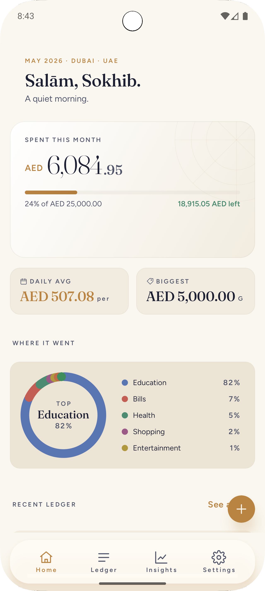<br /><sub><b>Dashboard</b><br />Balance, pie, recent</sub></td>
    <td align="center">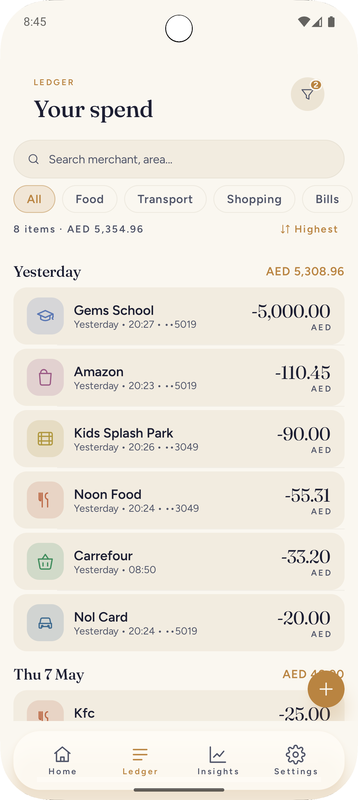<br /><sub><b>Ledger</b><br />Chip filters, search</sub></td>
    <td align="center">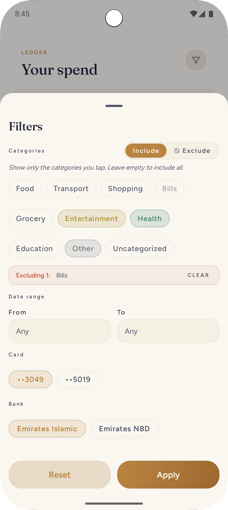<br /><sub><b>Filter</b><br />Multi-dimensional filtering</sub></td>
  </tr>
  <tr>
    <td align="center">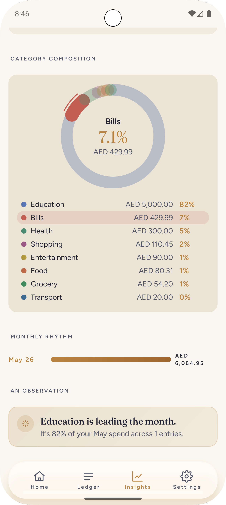<br /><sub><b>Insights</b><br />Trends & observations</sub></td>
    <td align="center">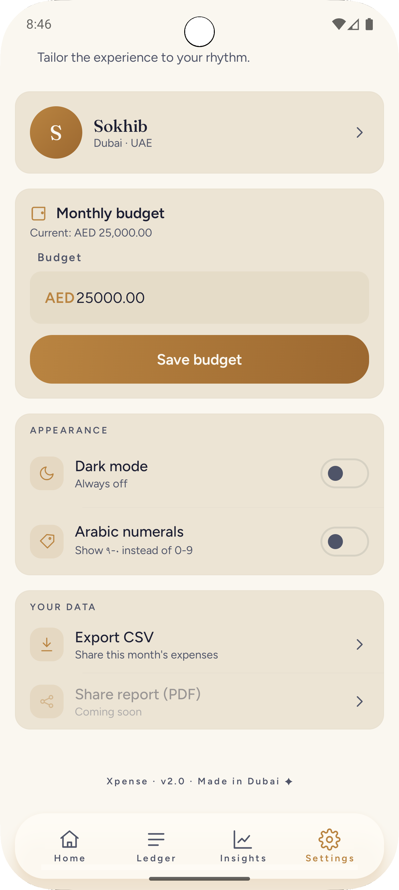<br /><sub><b>Settings</b><br />Theme, profile, perms</sub></td>
    <td></td>
  </tr>
</table>

## Screens — Layl (dark)

<table>
  <tr>
    <td align="center">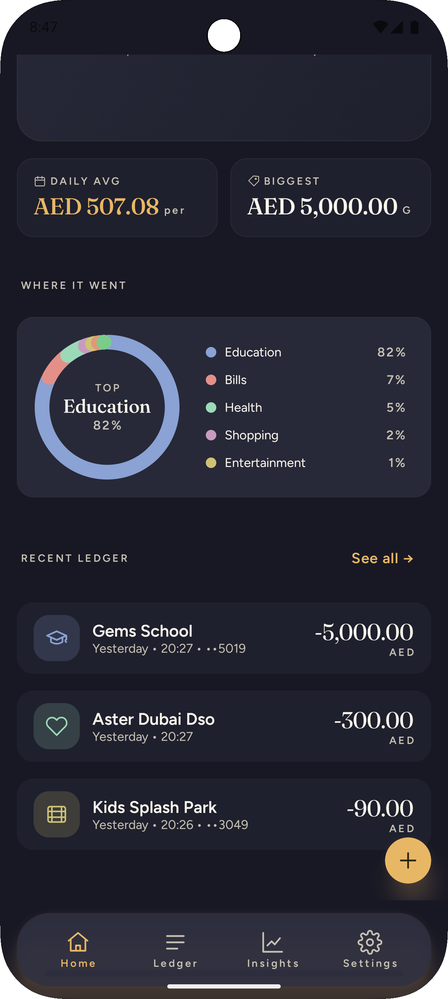<br /><sub><b>Dashboard</b></sub></td>
    <td align="center">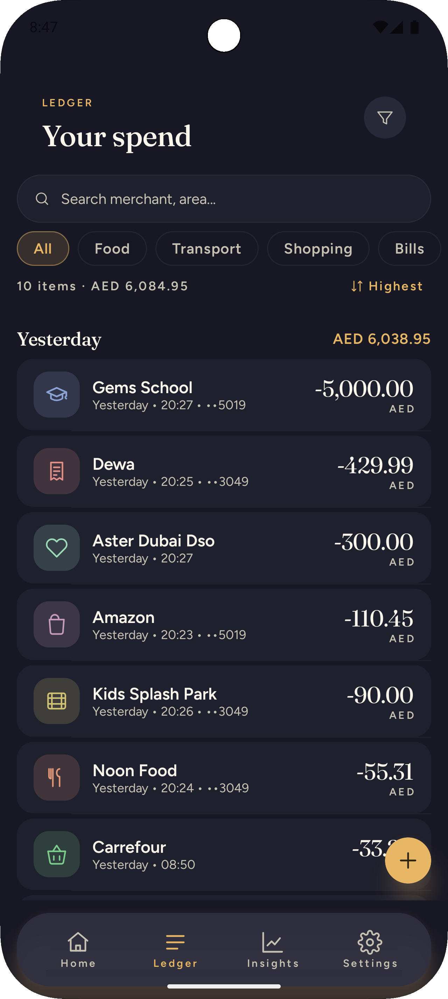<br /><sub><b>Ledger</b></sub></td>
    <td align="center">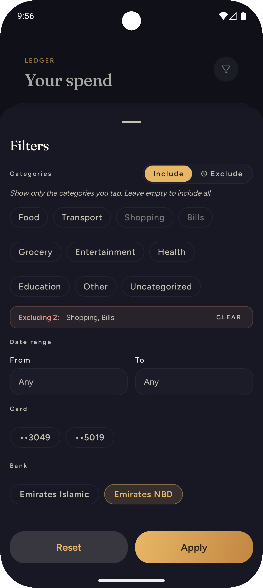<br /><sub><b>Filter</b></sub></td>
  </tr>
  <tr>
    <td align="center">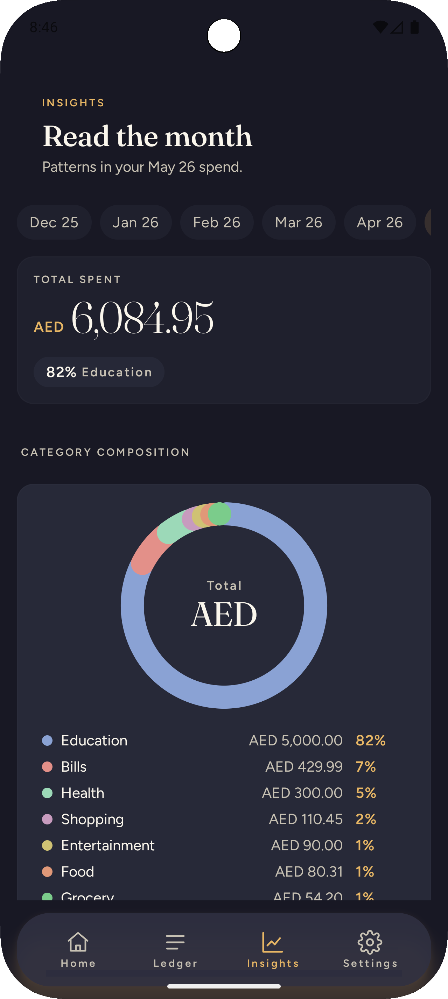<br /><sub><b>Insights</b></sub></td>
    <td align="center">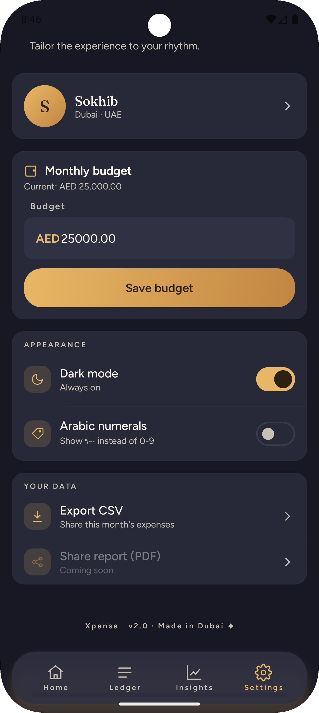<br /><sub><b>Settings</b></sub></td>
    <td></td>
  </tr>
</table>

---

## Architecture

Multi-module **MVVM + Clean Architecture**. Pure-Kotlin domain at the center.

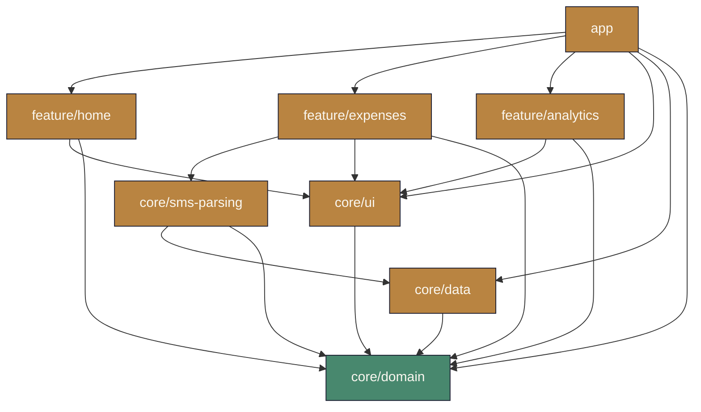

---

## Build variants

`flavorDimensions = ["tier"]` — Free and Pro install **side-by-side** (different `applicationId`s).

| Variant | applicationId | Capabilities |
|---|---|---|
| **Free** | `com.example.xpenstracker` | GPay notification capture |
| **Pro** | `com.example.xpenstracker.pro` | GPay **+** UAE bank SMS **+** self-learning queue |

---

## Tech stack

Jetpack Compose (BOM 2026.03.01) · Material 3 · Hilt 2.59.2 · Room 2.8.4 · DataStore 1.2.1 · Vico 3.0.3 · Kotlin 2.3.20 · KSP · Min SDK 28 · Target/Compile SDK 36

<details>
<summary><b>Project structure</b></summary>

```
app/                  Main activity, navigation, global ViewModels
  src/main/           Shared code + GPay notification listener
  src/free/           Rule-based classifier binding
  src/pro/            SMS listener + layered classifier
core/domain/          Pure Kotlin: entities, repos, use cases
core/data/            Room DB, DataStore, classifier rules
core/ui/              Theme + shared Compose components
core/sms-parsing/     Bank pattern catalog, regex parser, learned-pattern store
feature/home/         Dashboard + unmatched queue (Pro)
feature/expenses/     Expense list, filters, add/edit
feature/analytics/    Monthly insights + trends
```

</details>

---

## Privacy

XpensTracker is **on-device only**. No telemetry, no analytics, no backend. Notification and SMS content is parsed locally and never leaves your device. Notification access is split into two distinct services — *"XpensTracker — Google Pay"* and *"XpensTracker — Bank SMS"* — so you grant each independently.

---

<div align="center">

Built by [Sokhib](https://github.com/Sokhib) · Made with Compose

</div>
